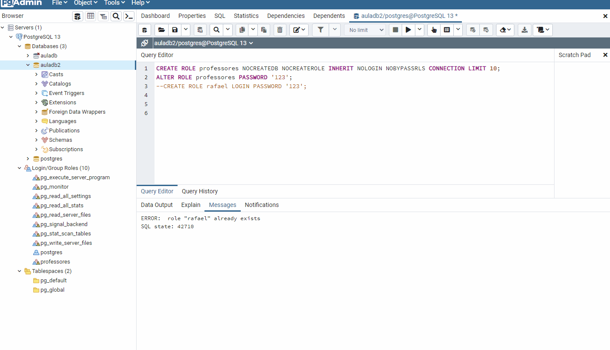

<h1 align="center">
  
   
  PostgreSQL Database Concepts and Best Practices module - DROP ROLE
</h1>

<h3 align="justify">
Instructions on how to drop a role via the DROP ROLE command on a database using pgAdmin4. In the same example it is recreated in an existing ROLE. Credits for Digital Innovation One's PostgreSQL database concepts and best practices module.
</h3>

 

## 📷 Demonstration

  
   

 

## 🚀 Technologies

This project was developed with the following technologies:

- PostgreSQL

 

## ⚙ Settings
- DROP ROLE "";
- SELECT "";
- RUN
- CREATE ROLE "" LOGIN PASSWORD '' IN ROLE "";
- SELECT "";
- RUN
 

---

Made with 💜 by Rafael Maciel
